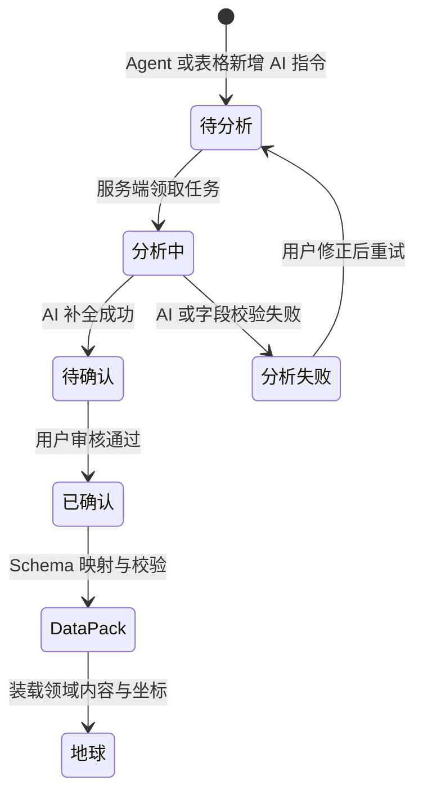
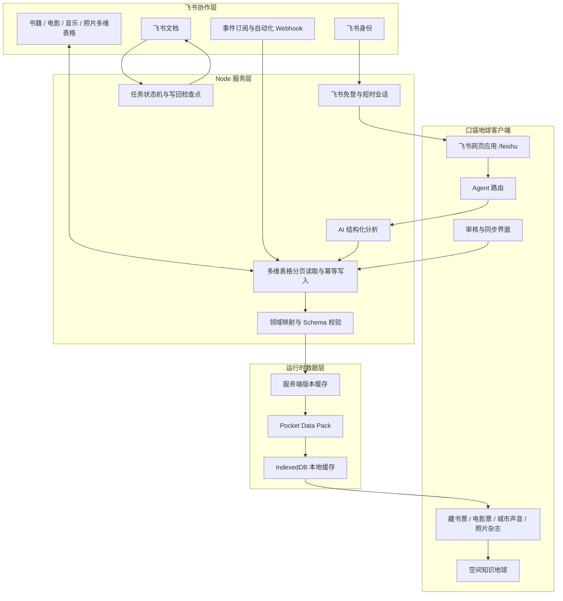

# 口袋地球 · Feishu Pocket Earth

> 在飞书里，做一颗可以审核、协作、持续生长的知识星球。

口袋地球是一款运行在飞书客户端中的空间知识库产品。它把散落在飞书文档、多维表格和个人相册里的书籍、电影、音乐与照片，整理成带有来源、审核状态和真实坐标的知识记录，再将用户确认后的内容呈现在可探索的地球上。

- 在线应用：<https://feishu-pocketearth.throughtheglass.art/feishu>
- 核心数据中枢：飞书多维表格
- AI 能力：自然语言理解、结构化字段补全、地点识别、照片评审
- 空间输出：藏书票、电影票、城市声音、照片杂志、日历与地球落点
- 人工闸门：只有“已确认”的记录会进入口袋地球

## 产品定位

我希望建立一款基于空间的个人知识库。书籍、电影、音乐和照片通常散落在文档、表格与相册中；时间久了，人仍然记得它们带来的感受，却很难重新找到这些内容与哪些地方、人物和经历产生过联系。

口袋地球为知识增加空间维度：

- 让一本书回到作者故乡或故事发生地；
- 让一部电影回到故事地点与真实取景地；
- 让一首歌回到它所关联的城市；
- 让一张照片回到拍摄地点；
- 让每个知识点保留来源、证据、审核状态和协作过程。

飞书多维表格本身很适合承载知识库。它既能管理结构化数据，也支持多人协作、审核流程和长期沉淀。口袋地球擅长空间表达，飞书擅长知识管理，两者共同形成从“输入、整理、审核、沉淀”到“空间探索”的完整闭环。

## 核心运行链路

```text
飞书身份 / 飞书文档 / 飞书多维表格 / Agent 自然语言输入
                         ↓
                 Agent 识别任务领域
                         ↓
          书籍 / 电影 / 音乐 / 照片 Skill
                         ↓
             AI 理解、补全字段、识别地点
                         ↓
             飞书多维表格：待确认记录
                         ↓
                   用户审核确认
                         ↓
        Schema 映射与校验 → Pocket Data Pack
                         ↓
       藏书票 / 电影票 / 城市声音 / 照片 → 地球
                         ↓
            飞书文档、多维表格与消息沉淀
```

飞书多维表格是四个核心 Skill 共用的协作数据中枢，管理知识的新增、分析、审核和写回；口袋地球只装载已经确认且通过 Schema 校验的知识记录。

## 为什么飞书和 AI 都参与核心运行

### 飞书负责什么

- 飞书网页应用提供真实运行入口；
- 飞书身份用于免登和用户会话；
- 飞书文档提供用户有权访问的真实原文；
- 飞书多维表格承载四个领域的结构化知识；
- 审核状态决定知识能否进入口袋地球；
- 飞书自动化与事件回调驱动缓存失效和同步；
- 分析结果、人工修订和最终状态继续沉淀在飞书中。

### AI 负责什么

- 理解用户输入的自然语言；
- 判断当前任务属于书籍、电影、音乐还是照片；
- 补全标题、作者或主创、类型、年份、简介等结构化字段；
- 从文档与知识内容中识别相关地点；
- 对候选地点给出证据、坐标建议与置信度；
- 对照片进行质量、故事性和地点评审；
- 将结果写回飞书，等待用户确认。

### 用户负责什么

- 选择真实文档、笔记或照片；
- 检查 AI 补全的字段；
- 校对地点和坐标；
- 修改多维表格中的审核状态；
- 决定哪些记录可以成为个人知识库中的确认内容。

### 口袋地球负责什么

- 将通过审核的记录映射为统一运行数据；
- 生成藏书票、电影票、城市声音和照片内容；
- 把知识放到真实地球坐标上；
- 让用户从知识卡片重新抵达相应地点；
- 在飞书暂时不可用时使用最近一次通过校验的本地缓存。

## 四类知识工作流

| 领域 | 输入 | AI 整理 | 飞书审核 | 口袋地球输出 |
|---|---|---|---|---|
| 书籍 | 自然语言、飞书文档、阅读笔记 | 书名、作者、国家、类型、年份、简介、候选地点 | `待分析 → 分析中 → 待确认 → 已确认` | 藏书票与故事地点 |
| 电影 | 自然语言、观影笔记、截图 | 导演、演员、类型、年份、故事地点、取景地 | 多维表格校对与确认 | 电影票与取景地 |
| 音乐 | 歌曲、歌手、城市线索 | 曲目、艺人、专辑、关联城市与坐标 | 多维表格校对与确认 | 城市声音标记 |
| 照片 | 本地相册选择 | 内容哈希去重、质量评审、故事性、地点与置信度 | 用户确认保留并核对地点 | 杂志、日历与地球照片 |

### 书籍：自然语言到藏书票

1. 用户在书籍 Agent 输入“用 AI 记录《酒吧长谈》，我很喜欢”。
2. Agent 将原始指令写入飞书书籍表，审核状态设为“待分析”。
3. AI 补全书名、作者、国家、类型、年份、简介和候选地点。
4. AI 把结果写回同一条飞书记录，并将状态更新为“待确认”。
5. 用户从处理结果直接打开飞书多维表格，校对内容、笔记、地点和坐标。
6. 用户把审核状态改为“已确认”。
7. 口袋地球同步后生成藏书票。
8. 点击藏书票，地球聚焦到该书关联的地点。

### 电影：自然语言到电影票

电影链路使用电影专用 Schema。AI 会整理导演、主演、类型、年份、简介、故事地点与取景地。用户可以直接从 Agent 的写入结果打开飞书多维表格；确认后的记录生成电影票，点击电影票可以定位到对应地点。

### 音乐：自然语言到城市声音

音乐 Agent 将歌曲、艺人和城市线索写入飞书音乐表。AI 补全曲目、专辑、城市和坐标；用户确认后，记录会成为地球上的城市声音标记。Agent 写入成功后同样保留直接打开飞书多维表格的入口。

### 照片：相册到可抵达的记忆

1. 用户主动从本地相册选择照片；
2. 客户端计算稳定内容哈希，识别重复图片；
3. AI 评估照片质量、故事性和可能地点；
4. 用户核对建议，选择保留、待定或排除；
5. 确认记录按稳定 `photo:<contentHash>` Pocket ID 写入飞书；
6. 同一照片再次处理时更新原记录，不制造重复数据；
7. 确认后的照片进入杂志、日历和地图；
8. 在杂志大图中点击“在地球定位”，可以回到对应的地图位置。

照片隐私边界：飞书只接收用户确认共享的元数据和可公开访问的 HTTPS 缩略图地址。本机原片、Base64、`blob:`、`data:` 与 `file:` 地址不会进入飞书或公开仓库。

## 飞书多维表格数据模型

应用为书籍、电影、音乐和照片创建四张独立数据表，并共享一组协作字段。

### 公共字段

| 字段 | 用途 |
|---|---|
| `Pocket ID` | 跨飞书、缓存与地球保持稳定的唯一标识 |
| `AI 指令` | 用户输入的自然语言原始指令 |
| `我的笔记` | 用户或协作者补充的主观内容 |
| `审核状态` | `待分析 / 分析中 / 待确认 / 已确认 / 分析失败` |
| `来源` | 飞书文档、Agent、照片整理或其他输入来源 |
| `Schema` | 当前领域的数据协议版本 |
| `数据 JSON` | 保存嵌套地点、曲目等完整领域结构 |
| `更新时间` | 同步与缓存失效依据 |

### 领域字段

| 领域 | 主要字段 |
|---|---|
| 书籍 | 标题、作者、国家或地区、类型、年份、评分、日期、简介 |
| 电影 | 标题、导演或主创、国家或地区、类型、年份、评分、日期、简介 |
| 音乐 | 标题、城市、纬度、经度、简介、曲目数据 |
| 照片 | 标题、城市、日期、纬度、经度、AI 评审元数据 |

用户修改常用列时，常用列会覆盖 `数据 JSON` 中对应的值；地点集合、曲目等嵌套内容继续保存在 JSON 中。服务端读取后会执行领域映射与 Schema 校验，非法记录进入 `rejected` 清单，不会替换当前可用数据。

## 审核状态机



只有 `已确认` 记录能够进入 Pocket Data Pack 和地球。空坐标可以保留为待校对信息，系统不会强行猜测并落地。

## 技术架构



### 前端架构

- React 18 + TypeScript + Vite；
- 飞书内嵌网页应用入口 `/feishu`；
- 飞书 JSSDK 免登桥接与服务端会话恢复；
- 地球、领域页面与重型依赖按需加载；
- IndexedDB 保存最近一次通过校验的 Data Pack；
- 飞书桌面端和移动端使用同一套响应式界面；
- 书籍、电影、音乐和照片拥有各自的卡片形式与地图交互。

### 服务端架构

- Node.js 原生 HTTP 服务；
- 飞书授权码换取用户身份，用户 access token 仅保存在服务端短时会话；
- 多维表格分页读取、字段映射、幂等 upsert、版本摘要与缓存失效；
- AI 密钥仅在服务端读取；
- 文档任务、AI 分析、人工审核和写回使用同一状态机；
- 写回按检查点执行，失败重试不会重复已经完成的步骤；
- 接口具有速率限制、请求大小限制、输入校验和安全响应头。

### AI 架构

默认服务端 AI 通过阿里云百炼 DashScope 的 OpenAI-compatible 接口调用，模型名称由环境变量控制。浏览器不会获得 API Key。产品界面统一使用“AI”描述能力，服务端保留实际模型、来源与工作流版本用于调试和审计。

### 运行数据架构

```text
飞书多维表格：协作、编辑、审核、事实来源
                 ↓ 分页读取 / 字段映射 / Schema 校验
Pocket Data Pack：前端运行投影、版本化数据包、离线缓存
                 ↓
口袋地球：卡片、地图、空间定位与探索
```

这个分层避免地图每次渲染都实时读取大量飞书记录，同时保留飞书编辑后自动同步的能力。

## 飞书架构

### 身份层

1. 飞书客户端加载 `/feishu`；
2. JSSDK 获取临时授权码；
3. 服务端使用 App ID 与 App Secret 换取用户身份；
4. 浏览器只保存短时应用会话标识；
5. 飞书 access token 不写入前端构建产物或任务快照。

### 文档层

1. 用户提供自己有权访问的新版飞书文档链接；
2. 服务端解析并校验 `docx` token；
3. 服务端以当前用户身份读取文档原文；
4. AI 从原文提取地点、连续证据和置信度；
5. 用户审核地点和坐标；
6. 结果追加回源文档，并可同步写入知识地点表。

### 多维表格层

- 一个 Bitable App 承载书籍、电影、音乐和照片四张领域表；
- 配置 `FEISHU_BITABLE_TABLE_ID` 后，同一 App 还可承载用于文档分析结果写回的知识地点表；
- 四个领域各自拥有 Table ID 和 Schema；
- `Pocket ID` 用于跨系统幂等写入；
- `审核状态` 是进入地球的明确闸门；
- `数据 JSON` 保存无法平铺的完整结构；
- 常用字段允许用户在飞书中直接修订；
- 自动化 Webhook 可以让指定领域缓存立即失效。

### 事件与自动化层

- 飞书事件回调地址为 `/api/feishu/events`；
- 服务端支持 Verification Token 与 Encrypt Key；
- 加密事件完成 AES-256-CBC 解密后再次校验 Token；
- 多维表格自动化调用 `/api/feishu/library/refresh`；
- 页面重新获得焦点、手动同步和定时版本检查也会触发刷新。

### 写回层

- AI 补全结果写回原多维表格记录；
- 人工确认决定记录是否进入地球；
- 文档任务可追加审核报告到源飞书文档；
- 地点结果可写入知识地点表；
- 可选消息卡片用于通知处理结果；
- 写回检查点防止网络重试产生重复内容。

## 自动同步

应用会在以下时机检查飞书数据版本，并只重载发生变化的领域：

- 飞书免登成功后；
- 用户点击“立即同步”时；
- 页面重新获得焦点时；
- 页面可见期间定时检查；
- 多维表格自动化调用刷新 Webhook 后。

若需要在飞书记录变化时立即使服务端缓存失效，可配置：

```dotenv
FEISHU_BITABLE_REFRESH_TOKEN=使用长随机字符串
```

然后在四张表中分别创建“新增记录或记录变更 → 发送 HTTP 请求”的自动化：

```http
POST https://你的域名/api/feishu/library/refresh
Content-Type: application/json
```

```json
{
  "token": "与 FEISHU_BITABLE_REFRESH_TOKEN 相同的值",
  "domain": "books"
}
```

`domain` 可使用 `books`、`movies`、`music` 或 `photos`。完整设置见 [`docs/feishu/多维表格与Data-Pack自动联动.md`](docs/feishu/多维表格与Data-Pack自动联动.md)。

## 一键创建个人知识库

飞书凭证配置完成后，用户可以在口袋地球中点击“新建你的知识库”。服务端会幂等创建或复用：

- `Pocket Earth · 书籍`；
- `Pocket Earth · 电影`；
- `Pocket Earth · 音乐`；
- `Pocket Earth · 照片`；
- 在具备用户授权时创建一篇说明字段和操作流程的飞书整理文档。

创建完成后，界面会持续显示“打开飞书多维表格”入口。用户可以在任一表新增一行，只填写 `AI 指令` 并将 `审核状态` 设为 `待分析`；AI 会补齐结构化字段和候选地点，再写回为 `待确认`。

文档分析链路所用的 `Pocket Earth · 知识地点` 表由 `npm run feishu:bitable:bootstrap` 幂等创建或复用，并通过 `FEISHU_BITABLE_TABLE_ID` 与服务端绑定。这样，四张领域表负责书籍、电影、音乐和照片的数据闭环，知识地点表负责飞书原文提取结果的结构化沉淀。

## 操作方式

### 方式一：通过 Agent 自然语言记录

1. 从口袋地球底部进入 `Skills`；
2. 选择书籍、电影或音乐 Skill；
3. 进入右侧 Agent 子页；
4. 输入自然语言，例如“用 AI 记录《酒吧长谈》，我很喜欢”；
5. 确认 Agent 识别的领域；
6. 点击写入；
7. 写入成功后直接打开飞书多维表格；
8. 等待 AI 把状态更新为“待确认”；
9. 校对字段，将状态改为“已确认”；
10. 返回口袋地球并同步；
11. 点击新生成的卡片，查看地球定位。

### 方式二：直接在飞书多维表格新增

1. 打开对应的书籍、电影、音乐或照片表；
2. 新增一行；
3. 在 `AI 指令` 中写下需求；
4. 把 `审核状态` 设置为“待分析”；
5. 等待服务端处理；
6. 检查 AI 写回的标题、主创、简介、地点和坐标；
7. 把状态改为“已确认”；
8. 口袋地球重新同步后装载该记录。

### 方式三：从飞书文档生成知识地点

1. 在飞书入口粘贴新版飞书文档链接；
2. 点击“读取飞书原文并生成知识地球”；
3. 等待 AI 提取地点、证据与置信度；
4. 对照原文审核候选地点；
5. 补充或修正坐标；
6. 确认后写入地球；
7. 将分析结果追加回源文档或知识地点表。

### 方式四：整理本地照片

1. 进入 `Photos`；
2. 点击选择照片，从系统相册主动选择内容；
3. 查看本地内容哈希去重结果；
4. 查看 AI 的保留、待定或排除建议；
5. 校对故事描述和地点；
6. 确认后写入飞书照片表；
7. 在杂志、日历或地图查看照片；
8. 在杂志大图点击“在地球定位”。

### 方式五：卸载示例库并装载个人数据

1. 在书籍、电影或音乐 Skill 中打开数据槽；
2. 卸载当前示例 Data Pack；
3. 新建或打开个人飞书知识库；
4. 在飞书中维护自己的内容；
5. 点击同步；
6. 页面数量、卡片和地图点位按照已确认记录自动更新。

## 快速开始

### 环境要求

- Node.js `>= 18.17`；
- npm；
- 飞书企业自建应用；
- 生产环境可访问的公网 HTTPS 域名；
- 服务端 AI API Key；
- Mapbox Token（可选，用于完整地图底图）；
- PaddleOCR 服务（可选，仅 PDF 与图片 OCR 需要）。

### 安装依赖

```bash
git clone https://github.com/narratorzhang0307/feishu-pocketearth.git
cd feishu-pocketearth
npm ci
```

### 本地配置

```bash
cp .env.example .env.local
```

最低本地界面验收配置：

```dotenv
FEISHU_DEV_BYPASS_AUTH=true
DASHSCOPE_API_KEY=你的服务端_AI_Key
VITE_MAPBOX_TOKEN=你的_Mapbox_Token
```

启动开发服务器：

```bash
npm run dev
```

访问：

```text
http://localhost:5173/feishu?feishuPanel=1
```

`FEISHU_DEV_BYPASS_AUTH` 只用于本地界面验收。生产部署必须设为 `false`。

## 飞书应用配置

### 1. 创建企业自建应用

在飞书开放平台创建企业自建应用，并启用网页应用能力。根据实际功能申请最小权限：

- 网页免登与用户基本信息；
- 新版飞书文档读取和编辑；
- 多维表格应用、数据表、字段和记录的读取与编辑；
- 消息发送（需要通知卡片时）；
- 事件订阅（需要自动刷新时）。

用户自身仍需拥有目标文档和多维表格的访问权限。

### 2. 配置网页应用主页

```text
桌面端主页：https://你的域名/feishu
移动端主页：https://你的域名/feishu
```

推荐在飞书客户端内打开。生产环境必须使用飞书可访问的 HTTPS 地址。

### 3. 配置事件回调

```text
https://你的域名/api/feishu/events
```

服务端支持 Verification Token 校验和 Encrypt Key 加密事件。生产环境建议同时配置二者。

### 4. 配置服务端环境变量

将 `.env.example` 复制为 `.env`，至少填写：

```dotenv
FEISHU_APP_ID=
FEISHU_APP_SECRET=
FEISHU_VERIFICATION_TOKEN=
FEISHU_ENCRYPT_KEY=
FEISHU_WEB_BASE_URL=https://你的域名

DASHSCOPE_API_KEY=
QWEN_MODEL=qwen-plus

FEISHU_BITABLE_APP_TOKEN=
FEISHU_BITABLE_TABLE_ID=
FEISHU_BITABLE_BOOKS_TABLE_ID=
FEISHU_BITABLE_MOVIES_TABLE_ID=
FEISHU_BITABLE_MUSIC_TABLE_ID=
FEISHU_BITABLE_PHOTOS_TABLE_ID=
FEISHU_BITABLE_REFRESH_TOKEN=

FEISHU_DEV_BYPASS_AUTH=false
FEISHU_ALLOW_PREEXTRACTED_OCR=false
```

所有 Secret 只允许由服务端读取。不要给 `FEISHU_APP_SECRET`、`DASHSCOPE_API_KEY` 等变量添加 `VITE_` 前缀。

### 5. 创建多维表格结构

如果已有一份空的多维表格并配置了 App Token，可以运行：

```bash
npm run feishu:bitable:bootstrap
```

脚本会幂等创建或复用四张领域表与知识地点表，并打印需要复制到 `.env` 的 Table ID。脚本不会把真实凭证写入仓库。

## 配置项说明

| 变量 | 必需性 | 说明 |
|---|---|---|
| `FEISHU_APP_ID` | 生产必需 | 企业自建应用 App ID |
| `FEISHU_APP_SECRET` | 生产必需 | 仅服务端使用的 App Secret |
| `FEISHU_WEB_BASE_URL` | 生产必需 | 飞书可访问的公网 HTTPS 根地址 |
| `FEISHU_VERIFICATION_TOKEN` | 事件回调必需 | 校验飞书事件来源 |
| `FEISHU_ENCRYPT_KEY` | 推荐 | 解密加密事件 |
| `FEISHU_BITABLE_APP_TOKEN` | 管理员脚本可选 | 仅供迁移、预检和示例模板；Web 用户使用自己的 Base |
| `FEISHU_BITABLE_*_TABLE_ID` | 管理员脚本可选 | 四个领域必须使用不同 Table ID，共享 ID 会预检失败 |
| `FEISHU_BITABLE_TABLE_ID` | 地点写回必需 | 知识地点表 ID |
| `FEISHU_BITABLE_REFRESH_TOKEN` | 自动刷新推荐 | 多维表格自动化调用的随机 Token |
| `DASHSCOPE_API_KEY` | AI 必需 | 服务端 AI 调用密钥 |
| `QWEN_MODEL` | 可选 | 默认文本模型，默认 `qwen-plus` |
| `VITE_MAPBOX_TOKEN` | 可选 | 地图底图；属于可公开的前端 Token |
| `PADDLE_OCR_URL` | 可选 | 自托管 OCR 服务地址 |
| `PADDLE_OCR_API_KEY` | OCR 必需 | 主服务与 OCR sidecar 之间的鉴权密钥 |
| `FEISHU_DEV_BYPASS_AUTH` | 仅本地 | 本地免登界面验收，生产必须关闭 |

完整变量说明见 [`.env.example`](.env.example)。

## 生产部署

### 上线前预检

```bash
cp .env.example .env
# 填写真实配置
npm run feishu:preflight
```

预检会检查飞书、AI、回调、多维表格、OCR 上限与生产安全开关，只输出检查状态，不打印密钥值。存在失败项时命令返回非零状态。

### Docker Compose

```bash
docker compose -f compose.feishu.yaml up --build -d
curl http://127.0.0.1:3009/healthz
```

编排包含：

- `pocket-earth`：网页应用与飞书/AI 服务；
- `paddle-ocr`：可选的自托管 OCR sidecar；
- `feishu-data`：任务与多维表格缓存；
- `paddle-models`：Paddle 模型缓存。

公网 HTTPS 应由 Nginx、Caddy 或云负载均衡终止，再转发到应用端口。

### 直接运行 Node 服务

```bash
npm ci
npm run build
API_PORT=3009 node server.mjs
```

生产环境推荐使用 PM2 或 systemd 守护，并只让 Node 端口监听内网。

## API 概览

| 方法与路径 | 作用 |
|---|---|
| `GET /api/feishu/config` | 返回浏览器可见的非敏感能力状态 |
| `POST /api/feishu/auth` | 飞书授权码换取服务端短时会话 |
| `GET /api/feishu/session` | 恢复仍有效的飞书会话 |
| `GET /api/feishu/library` | 获取四个领域的知识库快照 |
| `GET /api/feishu/library/versions` | 获取领域版本、记录数、待处理数与拒绝数 |
| `GET /api/feishu/library/:domain` | 读取单个领域的数据投影 |
| `POST /api/feishu/library/sync` | 重新读取飞书并处理待分析记录 |
| `POST /api/feishu/library/bootstrap` | 创建个人知识库及配套结构 |
| `POST /api/feishu/library/refresh` | 已禁用的全局刷新入口；个人 Base 必须在登录会话中同步 |
| `POST /api/feishu/library/:domain/records` | 写入登录用户对应领域表；`duplicatePolicy=warn` 会拦截同名重复 |
| `DELETE /api/feishu/library/:domain/records` | 从登录用户对应领域表删除指定 Pocket ID |
| `GET /api/feishu/library/open` | 不再跳转部署者 Base；客户端使用会话返回的个人领域 URL |
| `POST /api/feishu/photos/review` | 对用户主动选择的照片进行 AI 评审 |
| `POST /api/feishu/tasks/from-document` | 读取飞书文档并创建知识提取任务 |
| `POST /api/feishu/tasks` | 创建可选的 PDF 或图片任务 |
| `GET /api/feishu/tasks/:taskId` | 查询任务进度与结果 |
| `POST /api/feishu/tasks/:taskId/retry` | 从失败阶段重试任务 |
| `POST /api/feishu/writeback` | 提交人工审核并写回飞书 |
| `POST /api/feishu/events` | 接收、验签并处理飞书事件 |

## 数据持久化与缓存

- 任务元数据、审核结果和写回检查点保存在 `var/feishu/tasks/`；
- Web 用户的 Base Token 与四个 Table ID 仅保存在用户浏览器和短时登录会话，不写入服务器知识库缓存；
- 部署者的 `var/feishu/` 只保留管理员脚本生成的模板配置，不作为个人知识的回退库；
- 飞书文档原文、文件 Base64 和用户 access token 不写入任务快照；
- 个人会话缓存失效后会从该用户的飞书 Base 重新分页读取；
- `var/feishu/` 已被 Git 忽略，不会进入源码仓库。

## 安全与隐私

- App Secret、AI Key、Encrypt Key 和 OCR Key 仅由服务端读取；
- 真实凭证不得进入 README、截图、前端变量或 Git 历史；
- 飞书用户 access token 只保存在短时服务端会话；
- 文档读取限制为当前用户有权访问的飞书文档；
- 事件回调支持签名、时间窗、Token 与加密校验；
- 写接口使用限流、大小限制和输入校验；
- 只有用户确认的知识会进入地球；
- 本机照片原片默认留在本机；
- OSS 只承载公开、许可明确、版本化的前端资产和示例数据。

## 验证与测试

### 完整飞书验证

```bash
npm run feishu:verify
```

该命令依次执行：

1. TypeScript 类型检查；
2. 飞书服务端 Vitest 测试；
3. PaddleOCR 接口契约测试。

### 常用命令

```bash
npm run typecheck              # TypeScript 类型检查
npm test -- --run             # 全量 Vitest
npm run build                 # 生产构建
npm run feishu:verify         # 飞书链路验证
npm run feishu:preflight      # 上线配置门禁
npm run feishu:bitable:bootstrap
npm run feishu:bitable:sync
npm run feishu:demo-packs     # 生成轻量演示 Data Pack
npm run verify:first-paint    # 首屏资源门禁
```

正式验收建议至少覆盖：

- 飞书桌面端与移动端免登；
- Agent 自然语言写入多维表格；
- `待分析 → 待确认 → 已确认` 状态变化；
- 已确认书籍生成藏书票并定位地球；
- 已确认电影生成电影票并定位地球；
- 已确认音乐生成城市声音并定位地球；
- 照片去重、AI 评审、确认、杂志、日历与地球定位；
- 飞书文档读取、证据提取、人工审核和写回；
- 同一记录重复同步不产生副本；
- 服务重启后的任务与缓存恢复；
- 浏览器构建产物中不存在服务端 Secret。

## 飞书 AI 绝活大会参赛要求对照

以下清单依据参赛者提供的飞书官方活动页面截图整理，并结合飞书官方社区当前活动入口复核。活动页面或投稿表单如有更新，以最新官方页面和活动群通知为准。

### 有效作品硬性要求

| 官方要求 | 口袋地球对应实现 | 验证方式 |
|---|---|---|
| 解决工作或生活中的真实问题 | 整理分散在文档、表格和相册中的个人知识，建立空间联系 | 实机展示书籍、电影、音乐、照片四类内容 |
| 飞书参与产品核心运行 | 身份、文档、多维表格、审核、写回和长期沉淀均在飞书中完成 | 在飞书客户端运行完整链路 |
| AI 参与产品核心运行 | AI 理解自然语言、补全字段、提取地点并评审照片 | 展示待分析到待确认的字段变化 |
| 飞书与 AI 共同驱动产品 | 飞书提供真实输入和审核状态，AI 生成结构化候选，用户确认后改变地球内容 | 飞书记录状态变化后，口袋地球新增卡片和地点 |
| 产品可以真实使用 | 已提供桌面端、移动端网页应用和公网 HTTPS 部署 | 用真实飞书账号完成免登与写回 |
| 提供产品介绍和上手指南 | 本 README 包含定位、价值、架构、配置、操作和验证 | 提交 README 或公开文档链接 |

以下形式无法单独构成有效参赛作品：

- 只把 AI 生成结果粘贴到飞书；
- 只在作品中提供一个飞书链接；
- 只使用 AI 辅助编写代码；
- 只展示界面，没有真实输入、分析、审核和结果变化；
- 用模拟数据或预设结果代替飞书与 AI 的真实运行。

### 参赛方式与官方流程

- 个人参赛，不限制开发经验；
- 每位参赛者限投 1 件作品；
- 工作提效、团队协作、个人知识管理或生活中的具体需求都可以成为题目；
- 活动允许已有产品参赛，但必须说明比赛期间新增的能力，并提供 Commit、更新日志或前后截图；
- 飞书和 AI 必须同时参与产品运行，不能停留在介绍页、外链或开发过程；
- 一件作品最多获得一个奖项。

官方截图给出的投稿过程可以整理为四步：

1. **制作作品**：使用飞书和 AI 解决一个真实问题；
2. **准备介绍与上手指南**：讲清楚为什么做、它是什么、带来什么价值、如何实现，并提供安装、配置和使用说明；
3. **录制并发布 Demo**：视频不超过 3 分钟，使用真实设备或客户端，先展示能力与效果，再跑一遍核心流程；
4. **填写投稿表单**：提交产品介绍、Demo 链接和上手指南，官方页面提示填写预计需要 5–8 分钟。

### 项目开发与增量证明

公开仓库保留飞书接口、知识库、审核闭环和四个领域工作流的提交记录。主要可核验模块包括：

- 飞书身份与短时服务端会话；
- 飞书文档读取、原文证据和写回；
- 四张多维表格与一张知识地点表；
- Agent 自然语言写入；
- AI 字段补全与地点识别；
- `待分析 → 待确认 → 已确认` 人工审核闸门；
- 已确认记录到藏书票、电影票、城市声音和照片的投影；
- 卡片点击到地球定位；
- 飞书自动化、版本缓存和 Data Pack 同步；
- 桌面端与移动端实机验证。

GitHub commit、更新日志、前后截图和实机证据可以共同说明开发过程。公开仓库只保存代码和公开文档；包含个人账号、联系方式和飞书内容的比赛证据保留在本地提交材料中。

### Demo 要求

- 录制真实产品操作；
- 视频不超过 3 分钟；
- 先展示产品能力与效果；
- 再跑一遍核心流程；
- 推荐以一条书籍记录作为主线：Agent 输入 → AI 写飞书 → 用户确认 → 同步 → 藏书票 → 地球定位；
- 电影、音乐和照片作为扩展能力快速展示；
- 删除网络等待、长时间静止和无效空白画面；
- 在飞书桌面端或移动端实机录制，能够看到飞书身份、表格审核和口袋地球结果变化。

### 投稿材料

正式投稿前需准备：

1. 产品介绍：说明是什么、为什么做、有什么价值、如何实现；
2. 上手指南：说明安装、配置、权限和使用方法；
3. 不超过 3 分钟的实机 Demo；
4. 将 Demo 发布到小红书、抖音、B 站或视频号中的任一平台；
5. 社媒内容带上 `#飞书AI绝活大会`；
6. 在官方投稿表单提交产品介绍、Demo 链接和上手指南；
7. 个人参赛，每人限投 1 件作品；
8. 提交前再次确认投稿表单中的最新字段和截止时间。

### 评选与奖项提示

- 所有有效作品进入社区投票；
- 社媒公开数据统计至 2026-08-31，最终规则以活动群和投稿页为准；
- 活动截图列出了绝活之王、最佳飞书 AI Native 实践、社媒最受欢迎、最佳业务价值、最佳团队提效、最佳个人效率、AI 使唤大师、创意特别奖、易上手奖和“小东西，大救星”等方向；
- 口袋地球重点对应“最佳飞书 AI Native 实践”“最佳个人效率”和“最佳业务价值”：飞书身份、多维表格、协作审核与 AI 分析共同参与核心链路，而非仅作为展示入口。

依据活动截图记录的时间节点：

| 时间 | 事项 |
|---|---|
| 2026-08-20 至 2026-08-28 | 作品征集 |
| 2026-08-28 18:00 | 截止投稿 |
| 2026-08-29 至 2026-08-31 | 社区投票 |
| 2026-09-03 | 直播 Demo 与颁奖 |

### 投稿前最终门禁

- [ ] 公网 HTTPS 地址加载最新代码；
- [ ] 飞书应用最新版本已经创建、发布并通过管理员审核；
- [ ] 生产环境 `FEISHU_DEV_BYPASS_AUTH=false`；
- [ ] `npm run feishu:preflight` 为 0 个失败；
- [ ] 真实账号完成飞书免登；
- [ ] 真实跑通文档或 Agent → AI → 待确认 → 已确认 → 地球；
- [ ] 真实完成飞书文档或多维表格写回；
- [ ] 书籍、电影、音乐和照片至少各保存一组清晰证据；
- [ ] Demo 画面不超过 3 分钟且没有长时间空白；
- [ ] 产品介绍与上手指南可公开访问；
- [ ] 视频已经发布并带活动话题；
- [ ] 官方投稿表单已经提交。

## 项目目录

```text
.
├── src/app/feishu/              # 飞书前端桥接、类型与 API 客户端
├── src/app/components/          # 地球、Skill、Agent 与领域页面
├── server/feishu/               # 免登、文档、多维表格、任务与写回
├── scripts/                     # 预检、表格初始化、同步与 Data Pack 工具
├── services/paddle-ocr/         # 可选自托管 OCR sidecar
├── public/data-packs/           # 轻量演示数据包
├── docs/feishu/                 # 部署、同步、验收与 Demo 文档
├── Dockerfile.feishu            # 应用容器
├── compose.feishu.yaml          # 应用与 OCR 编排
├── server.mjs                   # 生产 Node 服务入口
└── .env.example                 # 无敏感值的配置模板
```

## 相关文档

- [部署与上手指南](docs/feishu/部署与上手指南.md)
- [多维表格与 Data Pack 自动联动](docs/feishu/多维表格与Data-Pack自动联动.md)
- [比赛要求逐条验收](docs/feishu/比赛要求逐条验收.md)
- [三分钟 Demo 脚本](docs/feishu/三分钟Demo脚本.md)
- [OSS 资产发布策略](docs/deploy/OSS-ASSET-POLICY.md)

## 当前边界

- 生产运行需要使用者自己的飞书企业自建应用凭证与 AI Key；
- 飞书开放平台权限变更需要创建并发布新的应用版本；
- 用户必须拥有目标飞书文档和多维表格的访问权限；
- PDF 与图片 OCR 属于可选入口，不影响飞书文档和多维表格主链；
- 地图底图未配置时保留降级视图，完整地理体验需要 Mapbox 或其他受支持地图配置；
- 自动生成的候选地点仍需人工核验，空坐标不会被猜测或强制落地；
- 活动规则与时间以飞书官方最新公告和投稿表单为准。

## License

当前仓库尚未附加开源许可证。公开可见不等于自动授权复制、修改或再分发；如需使用代码或素材，请先联系仓库所有者。
