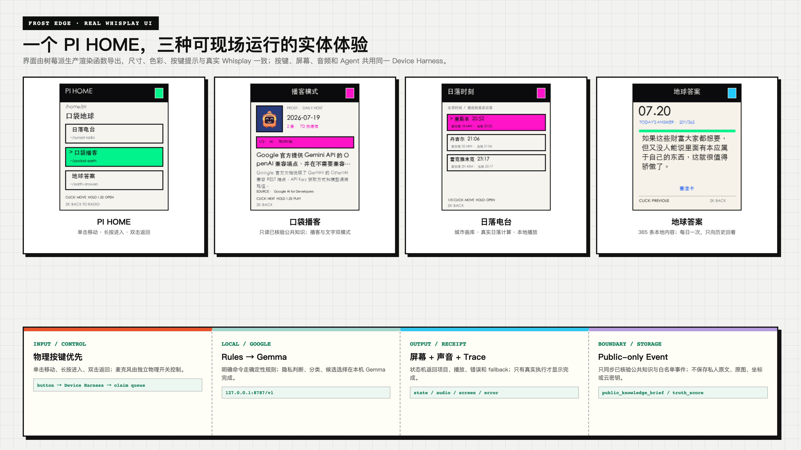

# Frost Edge Node · Google AI Edition

Frost Edge Node 是 Pocket Earth 的树莓派实体端：同一个 Frost Agent 从网页进入桌面硬件，通过 240×280 小屏、按钮、RGB 灯与本地 TTS 呈现音乐、城市日落和经过来源约束的公共知识简报。



设备端的智能路由由 Google `Gemma 4 E4B IT QAT Q4_0` 提供。5.15GB GGUF 权重被安装在 Pocket Earth 独立目录，由 `llama-server` 仅监听 `127.0.0.1:8787`；设备不保存任何云密钥。确定性规则先处理明确指令，Gemma 只处理含糊的本地选择；需要复杂跨文化理解或视觉补全时，由中心服务在用户授权后调用 Gemini。官方 Gemini API 为主路径，GMI 只可作为 Google Gemini 模型的备用传输层，并显式记录 provider、modelOwner 与 transport。

## 三个实体入口

| 根项目 | 子模式 | 作用 |
|---|---|---|
| 日落电台 | 歌曲目录 / 日落时刻 / 随机骰子 | 沿真实城市日落线选择音乐，按钮可直接切换城市或曲目 |
| 口袋播客 | 播客模式 / 文字模式 | 自动同步并播放通过来源门槛与 Google AI 核验的每日知识 |
| 地球答案 | 每日答案卡 | 在设备本地滚动与抽取 365 条原创回答 |

`raspi/frost_pi_project_launcher.py` 是三项目的统一 Whisplay 启动器；`sunset-radio/` 保存日落电台的设备源码；`raspi/earth_answers_365.json` 保存地球答案数据。

播客不是占位页：`raspi/frost_pi_podcast_sync.py` 每天从线上 Google 版读取与 Web 端相同的 `pocket-earth-daily-podcast/v1` 产物，验证每条至少两个来源后原子落盘。按钮单击切换条目，长按 1.2 秒才播放当前条目；断网时保留上一份有效缓存。同步定时器默认北京时间 08:20 执行。

## Google AI 公共知识硬件闭环

```text
Public Earth source snapshots
  → Gemini Investigator
  → Gemini Skeptic
  → deterministic Truth Score
  → human confirmation gate
  → public_knowledge_brief JSONL
  → Raspberry Pi screen / LED / local TTS
```

```text
按钮 / 本地文本
  → 确定性规则
  → Gemma 4 E4B（树莓派本地）
  → 固定 skill 白名单
  → 屏幕 / LED / 本地 TTS

复杂且获授权的任务
  → Pocket Earth HTTPS 服务
  → Gemini Flash
  → Validator / Critic / Confirm Gate
```

硬件只接收两类业务事件：

- `music_now_playing`：曲名、艺人、城市与公开播报句。
- `public_knowledge_brief`：标题、短摘要、公开来源 URL、Truth Score 和 `review_required / insufficient` 状态。

事件白名单由 `frost-hardware-bridge.mjs` 和 `raspi/frost_pi_event_adapter.py` 双重执行。云端密钥、完整画像、照片、精确坐标和私人记忆不得进入硬件事件。模型也不能把知识直接标为已发布；设备始终显示人工闸门状态。

线上 Web 服务通过 `/api/frost-feed` 提供鉴权、游标式 JSONL。树莓派端配置：

```bash
export FROST_FEED_URL=https://pocketearth-google.throughtheglass.art/api/frost-feed
export FROST_FEED_TOKEN='与服务器 .env 相同的独立随机值'
python3 raspi/frost_pi_feed_client.py --once
```

游标只在屏幕、灯光与本地 TTS 动作组成功返回后原子推进；断网重试不会跳过尚未执行的简报。

## 可复验

```bash
node --test hardware/frost-edge-google/frost-hardware-bridge.test.mjs
node --test frost-feed-service.test.mjs
cd hardware/frost-edge-google/raspi
python3 frost_pi_project_launcher_smoke.py
python3 frost_pi_device_driver_smoke.py
python3 frost_pi_podcast_sync_smoke.py
python3 frost_pi_gemma_smoke.py
```

`raspi/install-gemma-edge.sh` 只向 `/opt/pocket-earth-gemma` 与 `/var/lib/pocket-earth-gemma` 安装运行时和模型。Google 版运行时写入 `/home/pi/pocket-earth`，不会修改原参考项目的源码目录。

## 验证状态

代码、安装器、服务定义、smoke test、4K 硬件图和数字孪生均已进入仓库。Gemma 4 E4B 已在 Raspberry Pi 5 真机完成模型发现与真实生成：服务状态为 `active (running)`，`/v1/models` 返回 `gemma-4-e4b-it`，Chat Completions 返回 `FROST EDGE READY.`。模型 SHA-256、端口隔离、耗时、资源占用和复验命令见 [`raspi/GEMMA-4-E4B-VALIDATION.md`](raspi/GEMMA-4-E4B-VALIDATION.md)。
